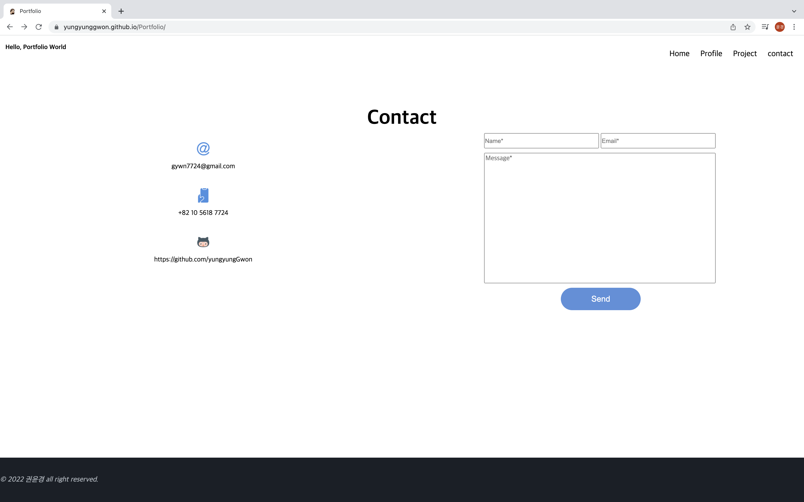

# Portfolio

* 보러가기 : https://yungyunggwon.github.io/twitter_clone/

## 프로젝트 목표

바닐라JS의 활용과 새로고침없이 페이지 이동이 가능한 포트폴리오 구현

## 프로젝트에 사용한 기술

Javascript, CSS3, React, Firebase

## 프로젝트 기능 설명

* Home 
 
</img>

* Profile
 
</img>

* Project
 
</img>

* Contact
 
</img>
